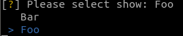
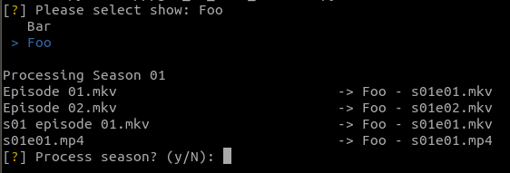

# Plex TV Show Renamer

A simple tool to rename TV show files to suit Plex.

# Usage

## Example
The tool operates on the '''TV Shows''' directory of a Plex-compliant media root directory:

A list of the directories in the root directory is presented:



Once a show is selected, the files for each season are shown in turn with an indication of how they will be renamed if the season is processed:



When processing is complete the next season is prompted for, or the program ends if all seasons have been presented.

Note that files that do not match any of the built-in patterns are warned about and subsequently ignored:


## Docker

The tool is most easily used as a Docker container, available from [this project's registry](https://gitlab.com/kimvanwyk/plex_tv_show_renamer/container_registry).

```bash
cd "/path/to/plex_media/TV Shows"
docker pull registry.gitlab.com/kimvanwyk/plex_tv_show_renamer:latest
docker run -it --rm -v "${PWD}":/io registry.gitlab.com/kimvanwyk/plex_tv_show_renamer:latest
```
